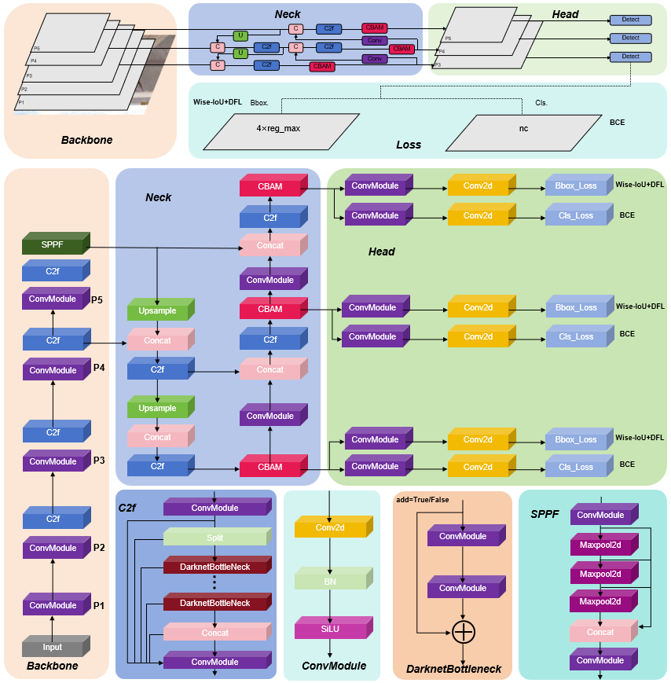
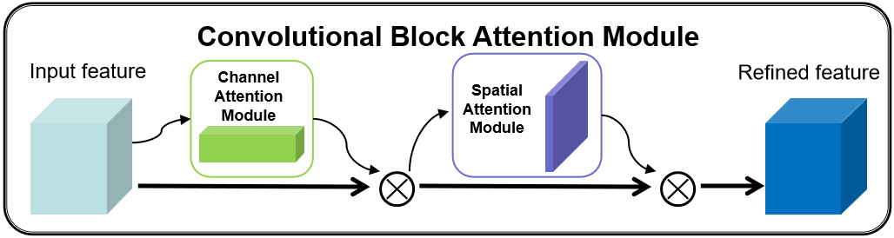
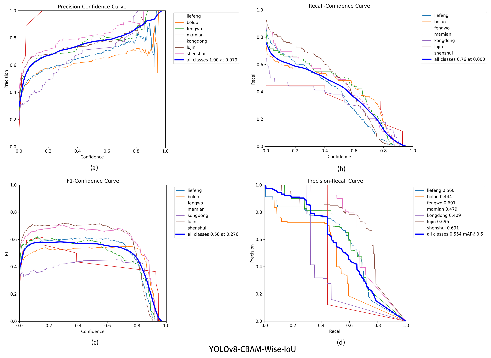
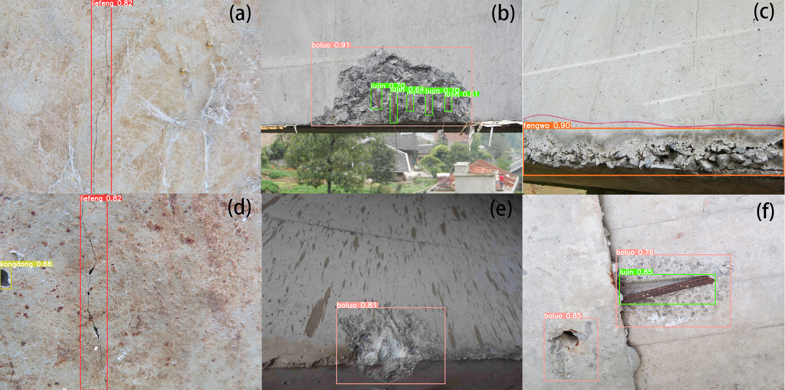
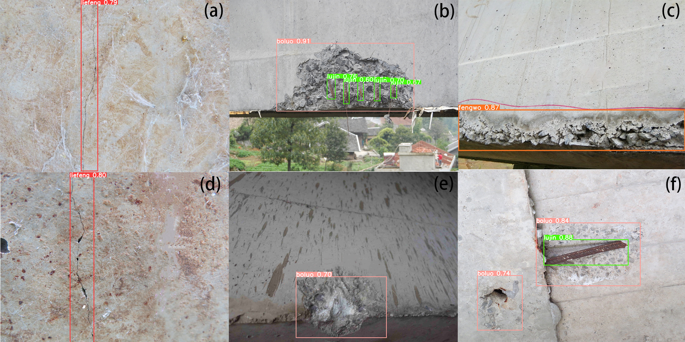
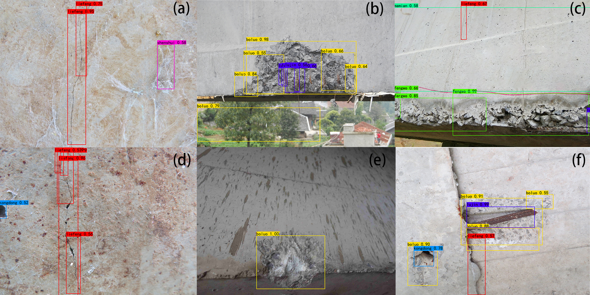
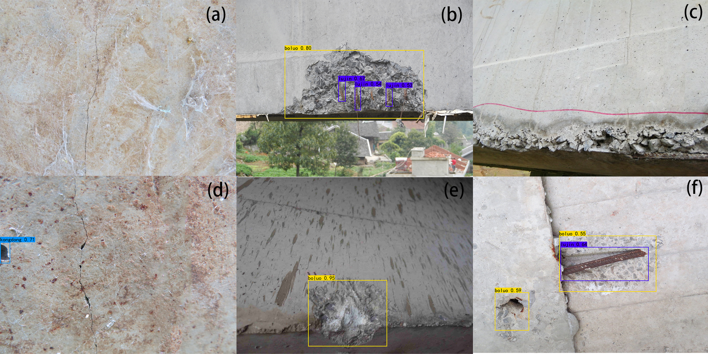

# Detection-of-Multiple-Defects-on-Bridge-Surfaces-with-Improved-YOLOv8

This repo contains the official **PyTorch** code for YOLOv8-CBAM-Wise-IoU .

## Introduction
With advancements in machine vision technology, numerous models have been created to identify defects on bridges. Nonetheless, most of these models focus on detecting individual defects and struggle to handle situations where multiple defects occur simultaneously. Consequently, rapidly identifying a variety of defects on bridge surfaces remains a significant challenge. To tackle this issue, this study proposes the YOLOv8-CBAM-Wise-IoU model, which is tailored to identify seven different types of defects on bridge surfaces. The model incorporates the CBAM attention mechanism along with the Wise-IoU loss function and evaluates performance using metrics such as precision, recall, F1 score, and mAP50. Comprehensive ablation studies and comparisons with one-stage and two-stage deep learning models were conducted to validate the model's effectiveness. The YOLOv8-CBAM-Wise-IoU model demonstrated strong results, achieving a precision of 97.9%, recall of 76%, F1 score of 58%, mAP50 of 55.4%, and mAP50-95 of 32.4%. These outcomes surpass those of baseline models and alternative ablation configurations, highlighting the model's capability to enhance detection accuracy and robustness across multiple defect types on bridge surfaces.

    

Fig.1. Architecture of the proposed YOLOv8-CBAM-Wise-IoU model.
  

This research employs YOLOv8 as the core framework due to its advantages over other commonly used CNN models. Notable benefits of YOLOv8 include its simplified architecture, reduced number of hyperparameters, and high-speed training and inference capabilities. Nonetheless, real-world images of bridge defects often exhibit complex backgrounds, featuring elements such as surface textures, shadows, and water stains. These factors introduce visual noise that can negatively influence the performance of crack detection models, making it harder to distinguish defects from their surroundings and leading to false positives or undetected defects. To overcome these obstacles, the proposed approach integrates the CBAM attention mechanism and Wise-IoU loss function into the YOLOv8 framework, resulting in the YOLOv8-CBAM-Wise-IoU model, which is specifically designed for detecting multiple surface defect types. The architecture of this model is depicted in Fig.1.

## Key Features:
(1)A dataset for detecting multiple bridge surface defects in Guizhou has been developed, encompassing samples of seven defect types. This dataset reflects the complexities of real-world scenarios to provide a robust testing ground for defect detection models.  
(2)The incorporation of the CBAM module into YOLOv8 introduces an innovative attention mechanism that dynamically adjusts channel and spatial weights in feature maps. This enhancement improves the model's ability to generalize and perceive defects effectively.   
(3)The Wise-IoU loss function is also innovatively employed in YOLOv8, utilizing a gradient gain recognition allocation strategy. This approach minimizes the negative impact of low-quality anchor boxes while reducing the competitiveness of high-quality ones. By emphasizing anchor boxes of average quality, the model achieves improved detection accuracy.  
(4)By combining the strengths of the CBAM module and Wise-IoU loss function, this study presents the YOLOv8-CBAM-Wise-IoU model. The proposed model is rigorously evaluated through the challenging task of detecting multiple defect types on bridge surfaces.  

## Method 

#### The CBAM module

    

Fig.2. The CBAM module.
 
This research integrates the CBAM attention mechanism into the Neck component of the model to enhance its ability to extract and fuse features. CBAM, a sophisticated attention mechanism, is specifically designed to optimize the performance of convolutional neural networks (CNNs). By dynamically modifying the channel and spatial weights in feature maps, CBAM improves the model’s capacity for generalization and perception, thereby increasing its effectiveness in detecting defects. The proposed model combines CBAM with the Wise-IoU loss function, resulting in an enhanced capability to accurately detect and localize multiple defects on bridge surfaces. The structure of the CBAM module is illustrated in Fig.2..

 

#### The Wise-IoU Loss Function
This study utilizes the Wise-IoU loss function as the bounding box regression loss, providing two significant advantages. First, it addresses challenges posed by low-quality samples in the training data. Specifically, it reduces the influence of geometric factors such as distance and aspect ratio, which can otherwise amplify penalties and hinder the model's ability to generalize. By limiting the impact of these geometric elements when the anchor box closely aligns with the target box, the Wise-IoU loss function enhances the model’s generalization performance. The mathematical representation of the Wise-IoU function is:

$$\begin{aligned}
L_{\text{WIoU}} &= R_{\text{WIoU}}L_{\text{IoU}} \\
R_{\text{WIoU}} &= \exp\left(\frac{(x - x_{\text{gt}})^2 + (y - y_{\text{gt}})^2}{(W_{\text{gt}}^2 + H_{\text{gt}}^2)^*}\right) \\
f_{\text{loss}} &= \lambda_1 f_{\text{BCEL}} + \lambda_2 f_{\text{DFL}} + \lambda_3 f_{\text{WIoU}}
\end{aligned}$$
  
In the Wise-IoU loss function, <i>Wg</i> and <i>Hg</i> represent the dimensions of the smallest enclosing bounding box. To maintain convergence speed, these parameters are detached from the computational graph (denoted by a superscript *), effectively mitigating factors that could slow convergence. The term <i>RWIoU</i> ∈ [1, e) substantially increases the impact of <i>LIoU</i> for anchor boxes of ordinary quality. Conversely, <i>LIoU</i> ∈ [1, e) significantly decreases <i>RWIoU</i> for high-quality anchor boxes, reducing their sensitivity to center point distance when alignment with the target box is already achieved. By integrating the Wise-IoU loss function into the overall loss formula, this method aims to improve boundary box regression performance, particularly by addressing geometric factors and the challenges posed by low-quality samples during training.
 

## Results

### The performance diagnostic curves
 

    

Fig.3. The performance diagnostic curves.
 
The performance diagnostic curve for YOLOv8-Wise-IoU is depicted in Fig. 3. In the F1-Confidence curve, the proposed model achieved its peak F1 score of 0.58 at a confidence threshold of 0.276, demonstrating superior performance relative to baseline methods. A larger area under the Recall-Confidence curve highlights the model’s high recall rate and reduced false positive rate. Additionally, the model's position in the upper right corner of the Precision-Recall curve, coupled with its larger area under the curve, underscores its overall detection efficiency.

 

### The comparison of heatmaps

 

    

Fig.4. The comparison of heatmaps.
   
As illustrated in Fig. 4, the YOLOv8-CBAM model effectively concentrates on defect regions within an image, particularly targeting specific areas to extract essential information. A comparison of the heatmaps reveals that incorporating the CBAM module into the YOLOv8 model significantly enhances the model’s focus on defect regions. This suggests that the CBAM module leverages both global and local information from bridge surface images to pinpoint critical features. Consequently, it strengthens the representation of key regions in defect recognition, improving the model's overall detection performance.

### Detection performance of different models for bridge surface defects  
Fig.5.-8. show the results of the YOLOv8-CBAM-Wise-IoU model, YOLOv8x model, Faster R-CNN model, and Retina Net model in detecting bridge surface defects.   

    

Fig.5. YOLOv8-CBAM-Wise-IoU model.
     

    

Fig.6. YOLOv8x model.
    

    

Fig.7. Faster R-CNN model.
  

    

Fig.8. Retina Net model.
  

## Dependencies

- Python 3.11
- torch == 2.3.1
- CUDA == 12.1
- torchvision == 0.18.1
- ultralytics == 8.3.33
- numpy == 1.26.3
- matplotlib == 3.9.0
- opencv-python == 4.10.0.84
- scipy == 1.13.1
- tqdm == 4.65.2

## Dataset

    

Fig.9. Sample of defect images in datase.
    
This study compiled a dataset of over 3,700 images showcasing various bridge defects in Guizhou, with annotations created using the LabelImg tool. The dataset is divided into 3,219 images for training, 246 for validation, and 246 for testing. It encompasses seven common defect types: cracks, seepage, leakage, spalling, honeycombing, decay, and voids. Additionally, the dataset incorporates diverse environmental conditions, such as varying sunlight, and includes features like paint, expansion joints, water stains, and dry moss. Examples of these images are presented in Fig. 9.
To ensure the rigor of the research and the confidentiality of the data, the dataset will not be publicly available until the paper is officially accepted, to prevent potential misuse or impact on the integrity of the research. Once the paper is accepted, we will promptly release the dataset for academic use, to promote further research and development in the related field.
