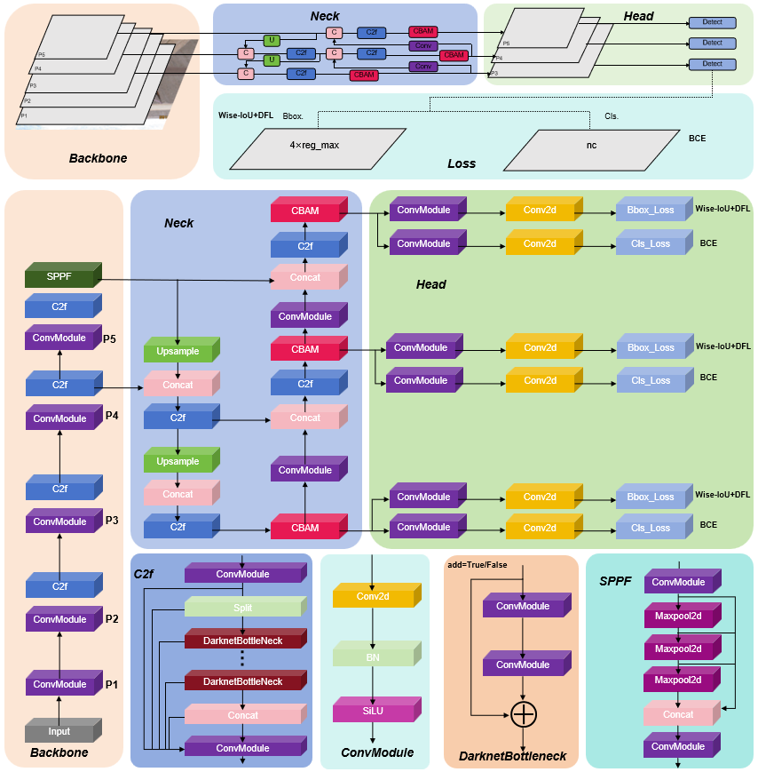
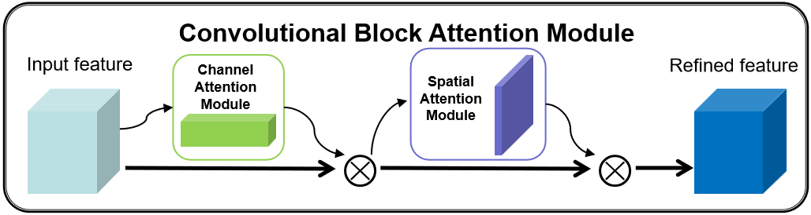
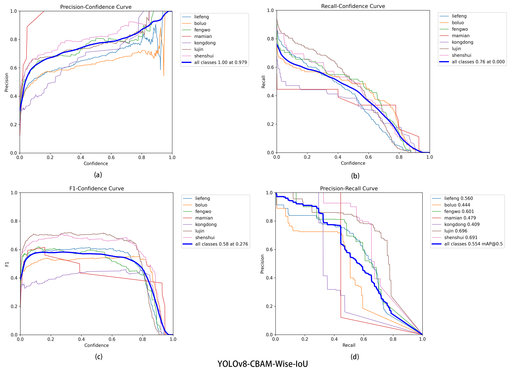
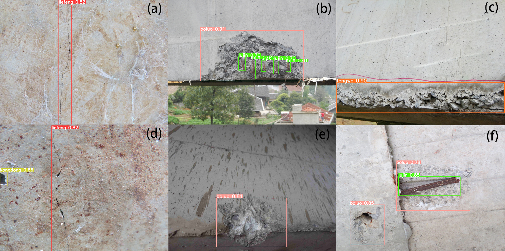
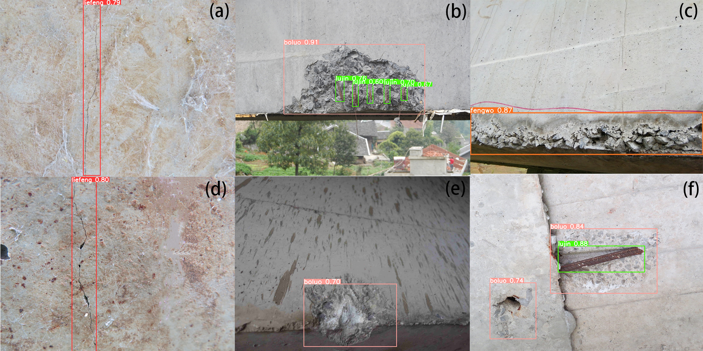
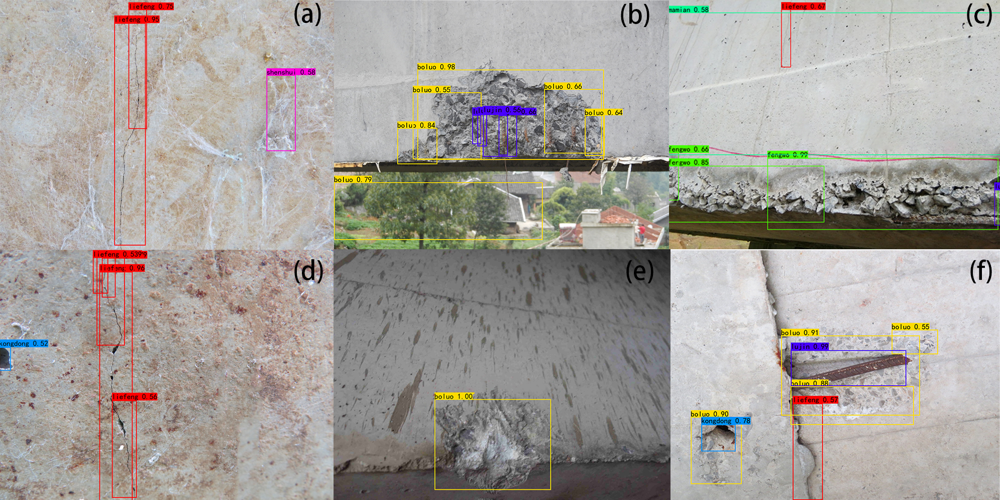
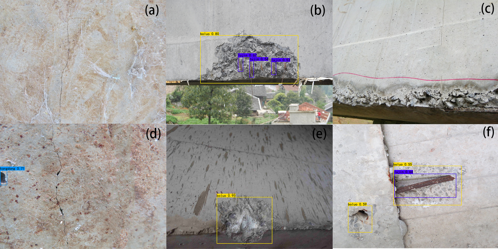

# Detection-of-Multiple-Defects-on-Bridge-Surfaces-with-Improved-YOLOv8

This repo contains the official **PyTorch** code for YOLOv8-CBAM-Wise-IoU .

## Introduction

    

Fig.1. Architecture of the proposed YOLOv8-CBAM-Wise-IoU model.
  

This study adopts YOLOv8 as the foundational framework. Compared to other widely used CNN models, YOLOv8 offers several benefits, including a streamlined structure, fewer hyperparameters, and rapid training and inference capabilities. However, real-world bridge defect images often feature intricate backgrounds with elements such as surface textures, shadows, and water stains. These complexities can adversely impact the accuracy of crack detection models by introducing visual noise that complicates the distinction between defects and their surroundings, resulting in false positives or missed detections. To address these challenges, this paper incorporates the CBAM attention mechanism and the Wise-IoU loss function into the YOLOv8 model, presenting the YOLOv8-CBAM-Wise-IoU model for detecting multiple types of surface defects. The structure of this model is illustrated in Fig.1..

## Key Features:
(1)The innovative addition of the CBAM module in YOLOv8 is an attention mechanism that adaptively adjusts channels and spatial weights in feature maps to improve the generalization and perception performance of defect detection models.  
(2)The innovative use of the Wise-IoU loss function in YOLOv8, which has a gradient gain recognition allocation strategy, strategically reduces the competitiveness of high quality anchor boxes and the adverse effects of low quality anchor boxes on gradients. This enables the model to prioritize average-quality anchor boxes, further enhancing its detection accuracy.  
(3)This paper proposes YOLOv8-CBAM-Wise-IoU model by integrating the advantages of CBAM module and Wise-IoU loss function, and validates the performance of the proposed model through the task of multi-defect detection on bridge surfaces.  

## Method 

#### The CBAM module

    

Fig.2. The CBAM module.
 
This study incorporates the CBAM attention mechanism into the Neck component of the model to strengthen its feature extraction and fusion capabilities. CBAM is an advanced attention mechanism designed to improve the performance of convolutional neural networks (CNNs). By adaptively adjusting channel and spatial weights in feature maps, CBAM enhances the model’s generalization and perception abilities, making it more effective in defect detection. The proposed model seamlessly integrates CBAM with Wise-IoU, further boosting its capacity to accurately identify and localize multiple defects on bridge surfaces. The structure of the CBAM module is illustrated in Fig.2..

 

#### The Wise-IoU Loss Function

The introduction of anchor-free methods in the YOLOv8 model has brought significant changes to the loss function. Optimization can be divided into two aspects: classification and regression. Compared to YOLOv5, the confidence loss function has been removed and replaced by a one-hot encoding format in the classification loss to indicate "whether this area contains such an object." The classification loss still uses Binary Cross-Entropy Loss (BCEL), and the bounding box regression loss employs Distribution Focal Loss (DFL) and CIoU loss. The loss function is expressed as:  

$$f_{\text{loss}} = \lambda_1 f_{\text{class}} + \lambda_2 f_{\text{DFL}} + \lambda_3 f_{\text{CIoU}}$$
  
Here, <code>floss</code> is the total loss, &lambda;1, &lambda;2, and &lambda;3 are weight factors assigned to each loss term, and <code>fclass</code>, <code>fDFL</code>, and <code>fCIoU</code> represent the individual loss functions for binary cross-entropy loss, distribution focal loss, and IoU loss, respectively. BCEL is used for classification, measuring the difference between the predicted class probabilities and the ground truth labels. DFL and CIoU losses are used for regression. DFL helps the network quickly focus on values near the label, maximizing the probability density at the label location. CIoU further optimizes the matching of bounding boxes, ensuring that the predicted box's center, size, and shape closely align with the ground truth box, while also accelerating model convergence.  
This study employs the Wise-IoU loss function from as the bounding box regression loss. This function offers two key advantages. Firstly, it tackles the problem of low-quality samples in training data, where geometric elements like distance and aspect ratio intensify penalties, thereby diminishing the model's ability to generalize effectively. An ideal loss function minimizes the impact of geometric factors when the anchor box closely matches the target box, enhancing the model's generalization capabilities. The Wise-IoU function is expressed as:

$$\begin{aligned}
L_{\text{WIoU}} &= R_{\text{WIoU}}L_{\text{IoU}} \\
R_{\text{WIoU}} &= \exp\left(\frac{(x - x_{\text{gt}})^2 + (y - y_{\text{gt}})^2}{(W_{\text{gt}}^2 + H_{\text{gt}}^2)^*}\right) \\
f_{\text{loss}} &= \lambda_1 f_{\text{BCEL}} + \lambda_2 f_{\text{DFL}} + \lambda_3 f_{\text{WIoU}}
\end{aligned}$$
  
Where, <i>Wg</i> and <i>Hg</i> are the sizes of the minimum bounding box. To prevent <i>RWIoU</i> from hindering convergence speed, <i>Wg</i> and <i>Hg</i> are detached from the computation graph (indicated by superscript *), effectively eliminating factors hindering convergence speed. <i>RWIoU</i> ∈ [1, e) significantly enlarges the <i>LIoU</i> of ordinary quality anchor boxes. <i>LIoU</i> ∈ [1, e) significantly reduces the <i>RWIoU</i> of high-quality anchor boxes and their focus on center point distance when the anchor box aligns well with the target box. The Wise-IoU loss function is incorporated into the overall loss formula, aiming to enhance its performance in boundary box regression tasks, especially in handling geometric factors and low-quality examples during training.
 

## Results

### The performance diagnostic curves
 

    

Fig.3. The performance diagnostic curves.
 
The performance diagnostic curve of YOLOv8-Wise-IoU is shown in Fig.3. In the F1-Confidence curve, at a confidence level of 0.276, the proposed model achieved the highest F1 score of 0.58, indicating superior performance compared to the baseline methods. A larger area under the Recall-Confidence curve indicates a higher recall rate and lower false positive rate for the developed model. The developed model is located in the upper right corner of the Precision-Recall curve, meaning the area under the curve is larger, reflecting its efficiency.

 

### The comparison of heatmaps

 

    

Fig.4. The comparison of heatmaps.
   
As shown in Fig.4., the YOLOv8-CBAM model can focus on defect areas in the image, especially specific regions, allowing it to extract more critical information from the image. By comparing the heatmaps, it can be inferred that after adding the CBAM module to the YOLOv8 model, the model's attention is focused on defect areas in the image. In summary, it can be concluded that the CBAM module utilizes both global and local information from bridge surface images to identify key information in the images, enhancing the representation of critical areas in bridge surface defect recognition, thereby improving the model's recognition capability.   

### Detection performance of different models for bridge surface defects  
Fig.5.-8. show the results of the YOLOv8-CBAM-Wise-IoU model, YOLOv8x model, Faster R-CNN model, and Retina Net model in detecting bridge surface defects.   

    

Fig.5. The results of  YOLOv8-CBAM-Wise-IoU model.
     

    

Fig.6. The results of  YOLOv8x model.
    

    

Fig.7. The results of Faster R-CNN model.
  

    

Fig.8. The results results of the Retina Net model.
  

## Dependencies

- Python 3.11
- torch == 2.3.1
- CUDA == 12.1
- torchvision == 0.18.1
- ultralytics == 8.3.33
- numpy == 1.26.3
- matplotlib == 3.9.0
- opencv-python == 4.10.0.84
- scipy == 1.13.1
- tqdm == 4.65.2

## Dataset

    

Fig.9. Sample of defect images in datase.
    
This study gathered a dataset of over 3,700 images depicting various bridge defects from Guizhou, annotated using the LabelImg tool. The dataset is divided into 3,219 images for training, 246 for validation, and 246 for testing. It includes seven common defect types: cracks, seepage, leakage, spalling, honeycombing, decay, and voids. Moreover, the dataset accounts for detection under varying sunlight conditions and includes features such as paint, expansion joints, water stains, and dry moss. Fig. 9. illustrates several of captured images.
To ensure the rigor of the research and the confidentiality of the data, the dataset will not be publicly available until the paper is officially accepted, to prevent potential misuse or impact on the integrity of the research. Once the paper is accepted, we will promptly release the dataset for academic use, to promote further research and development in the related field.
